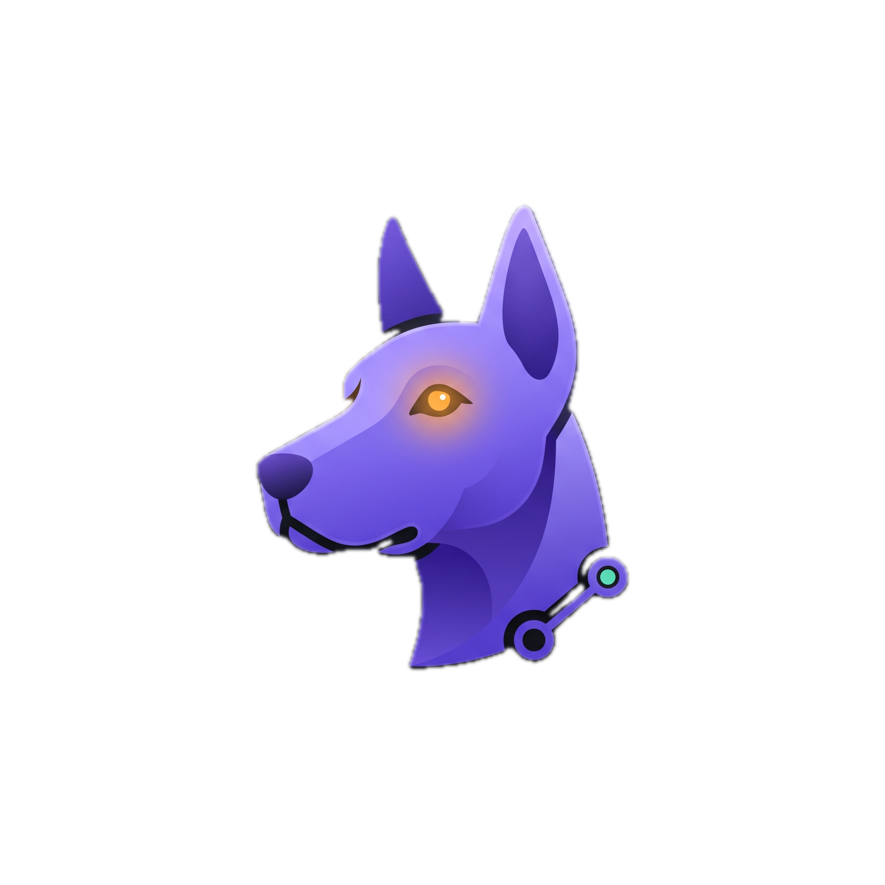

<div align="center">



# Kennel

**A node-based agentic IDE.** Development becomes a *canvas of states* — every agent
run and every command is a real, **git-versioned node** you can branch from, compare,
and build on.

[-7c6cff?style=for-the-badge&logo=apple&logoColor=white)](https://github.com/rishijohri/kennel/releases/latest)
[](LICENSE)


</div>

---

## What is Kennel?

Kennel turns AI-assisted development into a **spatial, branchable canvas**. Instead of a
linear chat that overwrites itself, each node on the canvas is a concrete, **committed
state of your codebase**. Run an agent, run a command, branch an idea — every step is a
node you can inspect, diff, check out, and grow from.

A *kennel* keeps and tends working "agents" (hounds). Two off-canvas operators embody
the metaphor:

- 🟣 **Care Taker** — tends the kennel: builds agent **personas** and deterministic **processes** (tested, with named I/O contracts).
- 🟢 **Walker** — walks the agents through the graph: an autonomous orchestrator that spawns and reads canvas nodes on an autonomy *leash* (a node budget).

> Built with Electron + React Flow. Every node is backed by a real git commit. Real
> Claude / OpenAI / Gemini calls — **no stubs, no simulations.**

---

## Download

**[⬇️ Download the latest macOS build](https://github.com/rishijohri/kennel/releases/latest)** — a universal (Apple Silicon + Intel) `.dmg`.

The build is **code-signed with a Developer ID and notarized by Apple**, so it opens
cleanly with no Gatekeeper warnings. Open the `.dmg` and drag **Kennel** into
Applications.

---

## Features

### 🧩 Canvas of git-versioned states
Each node is a real commit. Branch from any node to explore alternatives in parallel,
compare diffs side by side, and "check out" any state. The canvas is your project's
full, navigable history — not a disposable transcript.

### 🟢 Walker — autonomous orchestration
An off-canvas agent that plans and executes multi-step work across the graph, spawning
and reading nodes within an **autonomy budget** (Cautious ≤3 · Balanced ≤8 · Autonomous
≤25 nodes). It can build and tune workflows, and bind named inputs from ancestor nodes.

### 🟣 Care Taker — personas & processes
Designs reusable agent **personas** (with scoped permissions: edit files, run shell,
core memory, web search, MCP) and deterministic **processes** with tested,
Airflow-XCom-style **named I/O contracts** — push named outputs, pull bound inputs.

### 🔵 Parks — declarative workflows
Multi-node workflows with per-node declared outputs, tunable edge activation
conditions, a read-only-codebase + isolated-workspace file model, Report nodes,
run history, and cron scheduling.

### 🖥️ Local + cloud models
Bring your own keys for **Anthropic, OpenAI, and Google** (stored encrypted on-device
via Electron `safeStorage`), or run **fully local** models: the llama.cpp engine is
downloaded on demand and recommended HuggingFace (unsloth) models are a click away.

### 🔌 Web search & MCP
Keyless web search for agents, plus a real Model Context Protocol client
(`@modelcontextprotocol/sdk`) to connect external tools.

### 💬 Persistent agent chats
Walker and Care Taker keep multi-conversation history; runs continue in the background
while you work elsewhere on the canvas.

---

## How it works

```
┌───────────────────────────────────────────────────────────┐
│ TitleBar  (project · active node · Wake Mode · Settings)    │
├──────────┬───────────────────────────────┬─────────────────┤
│ Sidebar  │  FlowCanvas (React Flow)       │ NodeInspector   │
│ Care     │   …or ParkCanvas               │ Overview /      │
│ Taker +  │   nodes = git-versioned states │ Activity /      │
│ Walker   │   edges = branches             │ Files + diffs   │
└──────────┴───────────────────────────────┴─────────────────┘
```

1. **Open a project** (a git repo). The root node is your codebase's current state.
2. **Add a step** — an agentic node (persona-driven) or a deterministic command node.
3. **Run it.** Kennel executes the work in an isolated workspace and commits the result
   as a new node.
4. **Branch, compare, build on it.** Or hand the wheel to the **Walker** to orchestrate
   many steps autonomously.

---

## Tech stack

| Layer | Tech |
|---|---|
| Shell | **Electron 33** (`electron-vite`) |
| UI | **React 18** + **@xyflow/react** (React Flow) + **Tailwind** |
| Editor | **Monaco** (read-only code & diff views) |
| State | **Zustand** |
| Models | `@anthropic-ai/sdk` · `openai` · `@google/genai` · **llama.cpp** (local) |
| Tools | `@modelcontextprotocol/sdk` (MCP) |
| Versioning | real **git** commits per node |

See [`docs/DESIGN_SYSTEM.md`](docs/DESIGN_SYSTEM.md) for the full visual language
(color, type, motion, iconography, components).

---

## Build from source

```bash
# Requires Node.js 20+ and a recent macOS
npm install

# Develop
npm run dev

# Type-check
npm run typecheck

# Package a distributable (.dmg + .zip into release/)
npm run dist

# Package, then sign + notarize + staple the .dmg (needs Apple Developer creds)
APPLE_ID=... APPLE_APP_SPECIFIC_PASSWORD=... APPLE_TEAM_ID=... npm run dist:mac
```

Signing/notarization credentials are read from environment variables and are **never**
committed. API keys you enter in the app are encrypted on-device and stored outside the
repo.

---

## Privacy & security

- **Your API keys never leave your machine** except to call the provider you configured.
  They're encrypted at rest with Electron `safeStorage`.
- **No telemetry.** Kennel makes only the model/tool calls you initiate.
- Local models run entirely offline once downloaded.

---

## License

[MIT](LICENSE) © 2026 Rishi Johri
